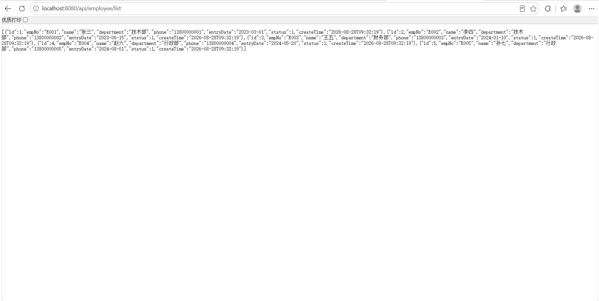
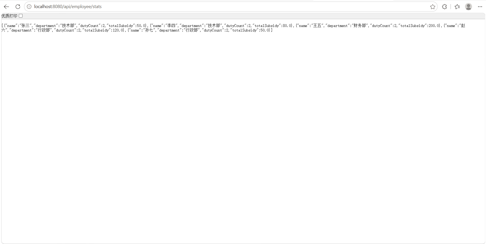

# 企业值班排班统计系统 (duty-system)

> 基于 SpringBoot + MyBatis + MySQL 的企业级后端实习项目

---

## 📌 项目简介

本项目是一个面向企业行政管理场景的后端服务系统，核心功能包括：

- 员工信息管理
- 按部门筛选查询
- **多维度数据统计分析**（每位员工的值班次数及补贴总额）

项目从 **数据库设计 → 接口开发 → 部署测试** 全流程由个人独立完成，代码规范、结构清晰，具备直接对接前端或测试工具（Postman）的能力。

---

## 🛠 技术栈

| 技术 | 用途 |
|------|------|
| Java 17 | 后端开发语言 |
| SpringBoot 2.7.x | 项目基础框架 |
| MyBatis | ORM 框架（注解式 SQL） |
| MySQL 8.0 | 关系型数据库 |
| Maven | 项目构建与依赖管理 |
| Git | 版本控制 |
| Navicat | 数据库可视化管理 |
| Postman | 接口测试工具 |

---

## 📁 数据库设计

### ER 图（核心三张表）

```
employee (员工表) ←→ schedule (排班记录表) ←→ duty (值班表)
```

### 表结构说明

| 表名 | 说明 | 关键字段 |
|------|------|----------|
| `employee` | 员工信息表 | id, emp_no, name, department, entry_date |
| `duty` | 值班班次表 | id, duty_name, subsidy, duty_type |
| `schedule` | 排班记录表（中间表） | id, employee_id, duty_id, schedule_date, attendance_status |

> 完整建表 SQL 见项目 `db/schema.sql` 文件

---

## 🔌 核心接口文档

所有接口遵循 RESTful 规范，返回标准 JSON 格式数据。

### 1. 查询所有员工
- **URL**：`GET /api/employee/list`
- **返回示例**：
```json
[
  {"id":1, "empNo":"E001", "name":"张三", "department":"技术部"},
  {"id":2, "empNo":"E002", "name":"李四", "department":"技术部"}
]
```

### 2. 按部门筛选员工
- **URL**：`GET /api/employee/department?dept=技术部`
- **返回示例**：同接口1，但只返回指定部门数据

### 3. 统计每位员工的值班次数及补贴总额 ⭐ 核心亮点
- **URL**：`GET /api/employee/stats`
- **返回示例**：
```json
[
  {"name":"张三","department":"技术部","dutyCount":2,"totalSubsidy":50.0},
  {"name":"王五","department":"财务部","dutyCount":1,"totalSubsidy":200.0}
]
```
- **涉及技术**：三表 LEFT JOIN + GROUP BY 分组聚合 + IFNULL 空值处理

---

## 🚀 快速启动

### 前置条件
- JDK 17+
- MySQL 8.0+
- Navicat（或其他数据库管理工具）
- IDEA（或任意 Java IDE）

### 启动步骤

1. **导入数据库**
   - 在 Navicat 中执行 `db/schema.sql` 脚本，自动创建数据库及三张测试表

2. **修改数据库配置**
   - 打开 `src/main/resources/application.properties`
   - 将 `spring.datasource.password` 改为你本机的 MySQL 密码

3. **启动项目**
   - 在 IDEA 中运行 `DutySystemApplication.java` 的 main 方法
   - 看到控制台输出 `Started DutySystemApplication` 即启动成功

4. **测试接口**
   - 浏览器访问：`http://localhost:8080/api/employee/list`
   - 返回 JSON 数据即为成功

---

## 📷 效果展示

- 接口1（全查）返回效果：


- 接口3（统计）返回效果：


---

## 📂 项目结构

```
duty-system/
├── src/main/java/com/demo/dutysystem
│   ├── controller/          # 控制器层（接口入口）
│   ├── entity/              # 实体类（Employee, EmployeeStats）
│   ├── mapper/              # 数据访问层（MyBatis Mapper）
│   └── DutySystemApplication.java  # 启动类
├── src/main/resources
│   ├── application.properties      # 核心配置文件
│   └── db/
│       └── schema.sql              # 建表及测试数据脚本
├── pom.xml                  # Maven 依赖管理
└── README.md               # 项目说明文档
```

---

## 🧠 项目亮点总结

- ✅ **独立完成**：从数据库设计 → 接口开发 → 部署测试全流程
- ✅ **SQL 优化实战**：通过 `EXPLAIN` 分析执行计划，合理添加索引
- ✅ **空值安全处理**：使用 `IFNULL` 处理聚合查询中的 NULL 值，确保接口稳定性
- ✅ **接口规范**：严格遵循 RESTful 设计，返回统一 JSON 格式
- ✅ **可快速部署**：项目附带完整 SQL 脚本，导入即可运行

---

## 🔗 相关链接

- **GitHub 仓库**：https://github.com/userLize7/duty-system
- **个人简历**：（建议放上你的简历链接或在线简历地址）

---

## 📝 备注

本项目为个人实习项目，旨在展示 Java 后端开发的基础能力，包括数据库设计、SQL 多表查询、SpringBoot 接口开发等核心技能。项目代码已全部开源，欢迎交流学习。

---

**最后更新**：2026年8月
